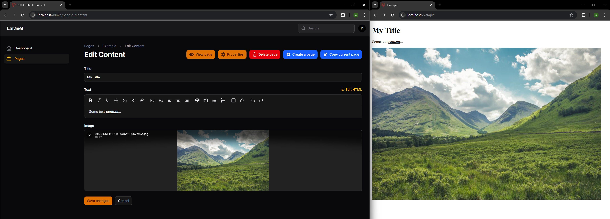
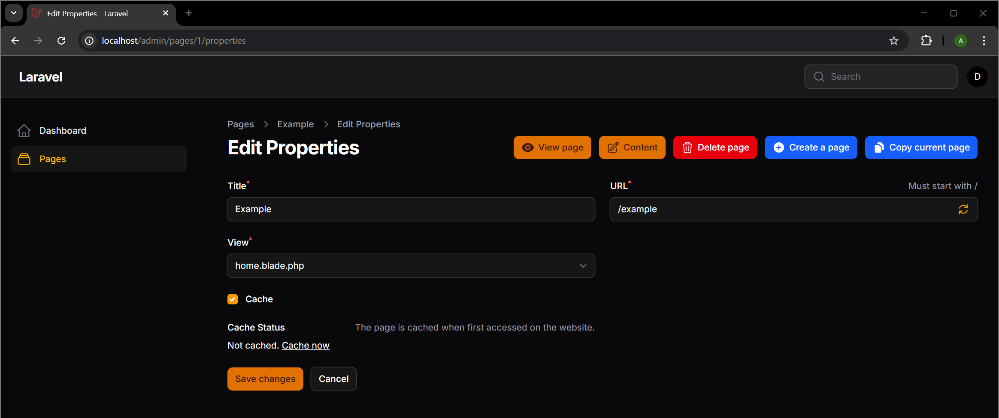
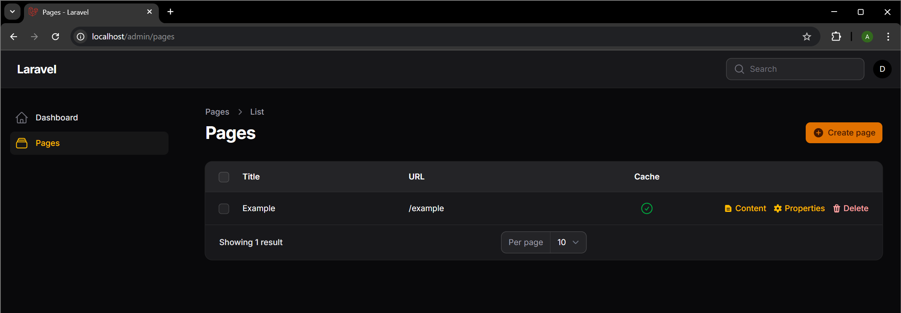

# Sitecode

Are you a developer in need to manage website page texts and images? This Filament plugin does exactly that.

You create a Laravel Blade page template. Specify the editable content with PHP code. Create the page through the Filament admin with the created Blade template and voilà! Your page is live and editable.

[Check the example in Usage](#usage)

## Filament plugin 

Filament v4 and v5 basic CMS like plugin. This plugin adds page management with page structure defined in `.admin.php` files.

This plugin allows to:

* Create, edit and disable pages;
* Assign pages to routes;
* Edit page text, images and videos.

Provides a robust cache. That caches the whole page completely and serves it using only the web server, without triggering any PHP processing. That reduces the page load times significantly and is crucial for those sweet Lighthouse SEO optimized green metrics. With this cache enabled, your web server would send your page within 10ms.

## Installation

1. Run `composer require alexeyplodenko/sitecode`.
2. Create the following directories and give PHP write and web server read permissions:
   1. `/public/media/` for image and file uploads
   2. `/public/sitecode_static_cache/` for pages cache
3. Create a public disk, if you need to edit images and files in Sitecode. Go to `/config/filesystems.php`, add the following to the `'disks'` array:
    ```php
    'sitecode_public_media' => [
        'driver' => 'local',
        'root' => public_path('media'),
        'url' => env('APP_URL').'/media',
        'visibility' => 'public',
        'throw' => true,
        'report' => true,
    ],
    ```
4. Register the plugin in Filament AdminPanelProvider `/app/Providers/Filament/AdminPanelProvider.php`:
    ```php
    <?php
    
    namespace App\Providers\Filament;
    
    use Filament\Panel;
    use Filament\PanelProvider;
    
    class AdminPanelProvider extends PanelProvider
    {
        public function panel(Panel $panel): Panel
        {
            return $panel
                // ...
                ->plugin(\Alexeyplodenko\Sitecode\SitecodePlugin::make()); // <-- Add this line
        }
    }
    ```
5. Run `php artisan sitecode:install` to install cache feature.
6. Run `php artisan migrate` to create DB tables to store data.

<a id="usage"></a>
## Usage

For example, we have the following Blade file `/resources/views/home.blade.php`:

```blade
<!DOCTYPE html>
<html lang="en">
<head>
    <title>My Website</title>
</head>
<body>
<main>
    <h1>My page title</h1>
    <p>My page content goes here...</p>
    <div>
        
    </div>
</main>
</body>
</html>

```

To make the content editable with `Sitecode`, create a file `/resources/views/home.admin.php` next to original `text.blade.php` file, with:

```php
<?php
$pageFields = new \Alexeyplodenko\Sitecode\Models\PageFields();

$pageFields->makeField('Title');
$pageFields->makeField('Text')->setEditorWysiwyg();
$pageFields->makeField('Image')->setEditorFile();

return $pageFields;
```

and then adjust the initial Blade file `/resources/views/home.blade.php`:
```blade
@php /** @var \Alexeyplodenko\Sitecode\Models\Page $page */ @endphp
<!DOCTYPE html>
<html lang="en">
<head>
    <title>{{ $page->title }}</title>{{-- $page->title comes from the page properties --}}
</head>
<body>
<main>
    @if ($page->hasContent('Title'))
        <h1>{{ $page->getContent('Title') }}</h1>
    @endif
    {!! $page->getContent('Text') !!}
    <div>
        getContent('Image') }}" alt="">
    </div>
</main>
</body>
</html>
```

Now go to Filament installation in your browser (by default at http://localhost/admin), and add your fist page in Pages. You want to create a page with our created `home.blade.php` view created before.

Here is the website page and its content: 

<a href="docs/images/sitecode-content.png"></a>

Here are the page properties:

<a href="docs/images/sitecode-properties.png"></a>

The list of pages:

<a href="docs/images/sitecode-pages.png"></a>

## Special cases

### Custom admin. panel domain

Define your custom admin. panel domain as `SITECODE_ADMIN_URL=https://admin.example.com` in `/.env` file, when the domain is different from your website domain.

### Custom disk name

Define your custom filesystem disk name as `SITECODE_DISK=sitecode_public_media` in `/.env` file, if you do not want to use the default one.

## Issues you might face

### Disk [sitecode_public_media] does not have a configured driver.

You have missed the step 3 from the Installation section of this document.
